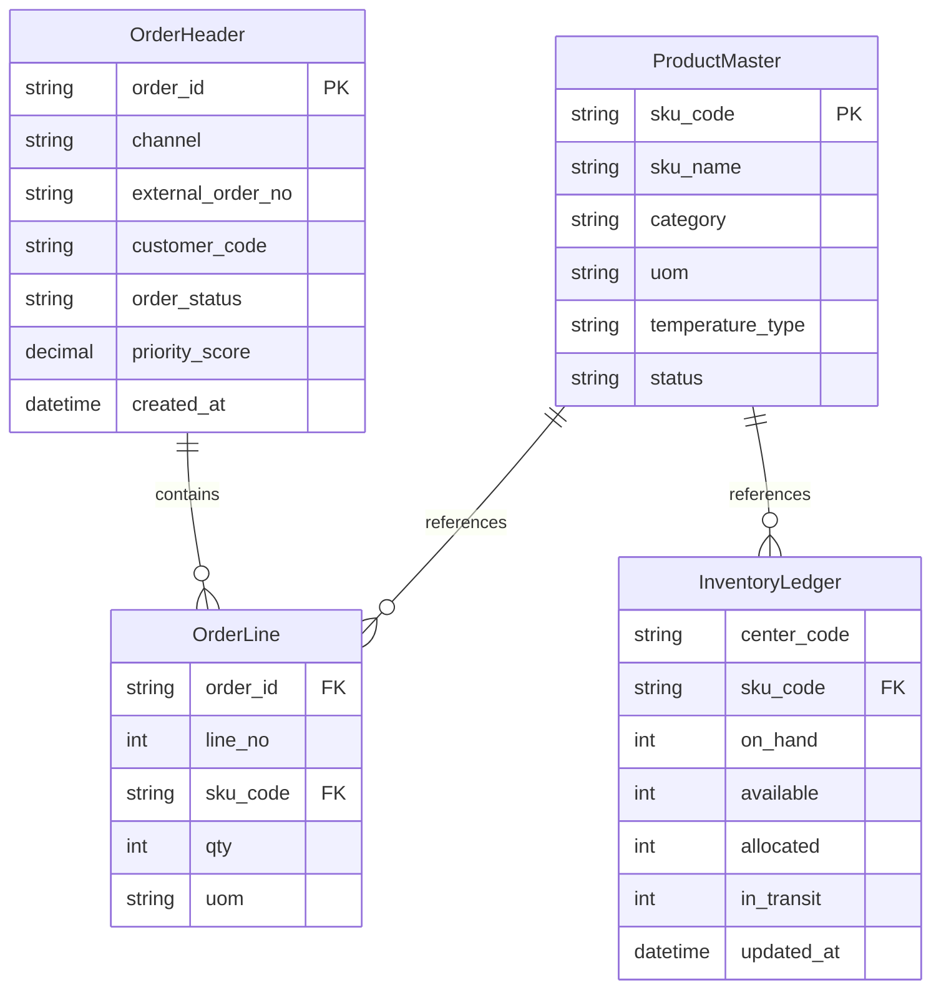

# Architecture Data Model v1

## Author
- Author: Analysis/Design Agent
- Date: 2026-04-10
- Version: v1.0

## Purpose
Define core logical entities, attribute constraints, and ERD relationships for OMS-WMS-MDH data consistency and implementation alignment.

## Audience
Backend developers, DB engineers, architects, and QA engineers.

## Table of Contents
- 1. Entity Attribute Definitions
- 2. ERD
- 3. Data Validation Rules
- 4. Master Data Seed Values

## Main Content

### 1. Entity Attribute Definitions
#### 1.1 OrderHeader
| Field | Type | Length | Required | Description | Validation |
|---|---|---:|---|---|---|
| order_id | VARCHAR | 36 | Y | Internal order ID | UUID |
| channel | VARCHAR | 20 | Y | Order channel | ENUM |
| external_order_no | VARCHAR | 64 | Y | External order number | Unique per channel |
| customer_code | VARCHAR | 32 | Y | Customer code | Exists in MDH |
| order_status | VARCHAR | 20 | Y | Order state | State machine validation |
| priority_score | DECIMAL | 5,2 | Y | Priority score | 0-100 |
| created_at | TIMESTAMP | - | Y | Created timestamp | ISO-8601 |

#### 1.2 OrderLine
| Field | Type | Length | Required | Description | Validation |
|---|---|---:|---|---|---|
| order_id | VARCHAR | 36 | Y | Order ID | FK(OrderHeader) |
| line_no | INT | - | Y | Line number | >0 |
| sku_code | VARCHAR | 32 | Y | SKU code | Exists in MDH |
| qty | INT | - | Y | Quantity | >0 |
| uom | VARCHAR | 8 | Y | Unit of measure | Code set |

#### 1.3 InventoryLedger
| Field | Type | Length | Required | Description | Validation |
|---|---|---:|---|---|---|
| center_code | VARCHAR | 16 | Y | Fulfillment center code | Exists in MDH |
| sku_code | VARCHAR | 32 | Y | SKU code | Exists in MDH |
| on_hand | INT | - | Y | Physical inventory | >=0 |
| available | INT | - | Y | Available inventory | >=0 |
| allocated | INT | - | Y | Allocated inventory | >=0 |
| in_transit | INT | - | Y | In-transit inventory | >=0 |
| updated_at | TIMESTAMP | - | Y | Last updated timestamp | ISO-8601 |

#### 1.4 ProductMaster
| Field | Type | Length | Required | Description | Validation |
|---|---|---:|---|---|---|
| sku_code | VARCHAR | 32 | Y | SKU code | PK, pattern check |
| sku_name | VARCHAR | 120 | Y | SKU name | Non-empty |
| category | VARCHAR | 40 | Y | Category | Code set |
| uom | VARCHAR | 8 | Y | Default UOM | Code set |
| temperature_type | VARCHAR | 16 | N | Temperature type | CHILLED/FROZEN/AMBIENT |
| status | VARCHAR | 16 | Y | Status | ACTIVE/INACTIVE/DEPRECATED |

### 2. ERD

### 3. Data Validation Rules
- All code keys must match regex `^[A-Z0-9-]+$`.
- All timestamps are stored in UTC and returned as ISO-8601.
- Referential integrity:
  - `OrderLine.sku_code` must exist in `ProductMaster.sku_code`.
  - `OrderHeader.customer_code` must exist in customer master.
- State change outside allowed transition is rejected.

### 4. Master Data Seed Values
#### 4.1 Product
| sku_code | sku_name | category | uom | status |
|---|---|---|---|---|
| SKU-APPLE-01 | Apple 1kg Box | FRUIT | EA | ACTIVE |
| SKU-BANANA-01 | Banana 1kg Box | FRUIT | EA | ACTIVE |

#### 4.2 FulfillmentCenter
| center_code | region | cutoff_time | capacity_limit | status |
|---|---|---|---:|---|
| FC-SEOUL-01 | KR-SEOUL | 17:00:00 | 200000 | ACTIVE |
| FC-BUSAN-01 | KR-BUSAN | 16:00:00 | 120000 | ACTIVE |

#### 4.3 Customer
| customer_code | customer_name | tier | status |
|---|---|---|---|
| CUST-001 | Alpha Retail | VIP | ACTIVE |
| CUST-002 | Beta Mart | STANDARD | ACTIVE |

## Change Log
- v1.0 (2026-04-10): Reorganized into documentation policy template and migrated to `doc/architecture`.

## Approvals
- [ ] PM review
- [ ] Architecture team review
