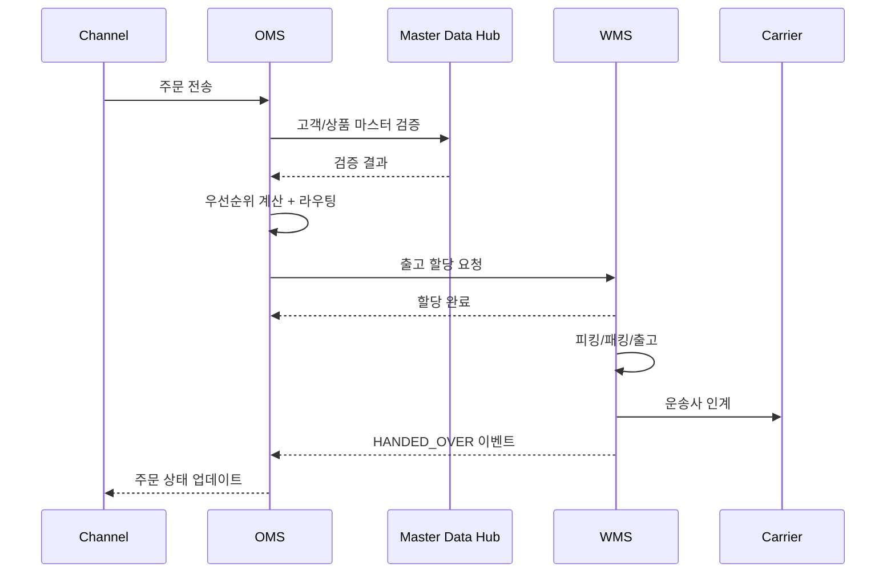

# OMS/WMS 주문-배송 프로세스 설계

## 작성자
- 작성자: 아키텍처 에이전트
- 작성일: 2026-04-10
- 버전: v1.0

## 목적 (Purpose)
OMS(Order Management System)와 WMS(Warehouse Management System) 간의 주문 수집부터 배송 완료까지의 전 과정을 상세히 정의하여, 시스템 간 인터페이스 설계와 예외 처리 전략을 명확히 한다.

## 대상 (Audience)
- 아키텍처 설계자: 시스템 간 상호작용 설계
- 개발팀: 프로세스 구현
- QA/테스트팀: 시나리오 기반 검증
- 운영팀: 예외 처리 및 모니터링

## 목차
1. End-to-End 절차
2. 예외 처리 프로세스
3. 통합 시퀀스 다이어그램
4. 운영 관점 체크포인트

---

## 1. End-to-End 절차

### 1.1 표준 주문-배송 플로우
1. OMS가 채널 주문을 수집하고 유효성 검사 수행
2. OMS가 우선순위를 산정하고 라우팅 엔진으로 센터 결정
3. OMS가 WMS에 출고 할당 요청 전송
4. WMS가 피킹/패킹/출고를 수행
5. 운송사 인계 후 OMS로 출고 확정 이벤트 전송
6. OMS가 주문 상태를 `DELIVERING` 또는 `COMPLETED`로 갱신

### 1.2 단계별 입출력
| 단계 | 입력 | 출력 | 소유 시스템 |
|---|---|---|---|
| 주문 수집 | 채널 주문 JSON/CSV/EDI | 내부 주문번호, RECEIVED 상태 | OMS |
| 우선순위 | 주문 헤더, 고객등급, SLA | priorityScore, priorityClass | OMS |
| 라우팅 | 주문, 재고요약, 컷오프정보 | centerCode/분할계획, reasonCode | OMS |
| 출고 할당 | orderId, lineItems, centerCode | allocationId, ALLOCATED 상태 | WMS |
| 피킹/패킹 | allocationId | PACKED 상태, 박스 정보 | WMS |
| 출고/인계 | shipmentNo, 송장 | SHIPPED/HANDED_OVER 이벤트 | WMS -> OMS |

## 2. 예외 처리 프로세스

### 2.1 재고 부족
- **조건:** 라우팅 대상 센터의 가용재고 < 주문수량
- **처리:**
  - OMS가 대체 센터 재탐색
  - 실패 시 `BACKORDER_REQUESTED` 상태 전환
  - 고객 알림 이벤트 발행

### 2.2 라우팅 실패
- **조건:** 규칙 충돌 또는 센터 전부 컷오프 초과
- **처리:**
  - 기본 폴백 규칙(고정 우선순위 센터) 적용
  - 폴백 실패 시 수동 검토 큐 등록
  - 운영자 알림 + 장애 카운터 증가

### 2.3 출고 중 검수 실패
- **조건:** 피킹 수량 불일치, 파손 발생
- **처리:**
  - WMS가 `EXCEPTION` 이벤트 발행
  - OMS가 주문 부분출고 가능 여부 평가
  - 필요 시 재피킹 요청 생성

## 3. 통합 시퀀스 다이어그램

## 4. 운영 관점 체크포인트

- **OMS 수집 지연:** 5분 초과 시 신규 수집 제한 모드 전환
- **WMS 피킹 실패율:** 2% 초과 시 파동 크기 자동 축소
- **이벤트 전송 실패 재시도:** 1분 간격, 최대 10회
- **DLQ 처리:** 10회 실패 시 DLQ 적재 및 수동 처리 큐 등록

## 변경 이력 (Change Log)
- v1.0 (2026-04-10): 초안 작성 (정책 준수 문서로 재정리)

## 승인 현황 (Approvals)
- [ ] 아키텍쳐 검토
- [ ] 개발팀 검토
- [ ] 운영팀 검토
