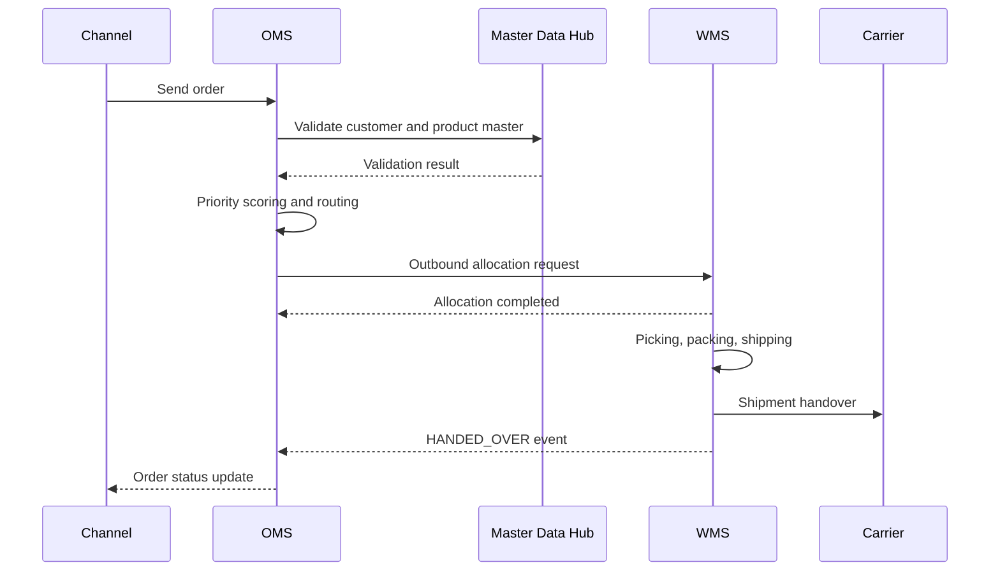

# Architecture Order Fulfillment Flow v1

## Author
- Author: Analysis/Design Agent
- Date: 2026-04-10
- Version: v1.0

## Purpose
Define end-to-end OMS-WMS fulfillment process, exception handling, and operational checkpoints for implementation and runbook alignment.

## Audience
Developers, solution architects, operations engineers, and QA engineers.

## Table of Contents
- 1. End-to-End Procedure
- 2. Exception Handling
- 3. Integrated Sequence Diagram
- 4. Operational Checkpoints

## Main Content

### 1. End-to-End Procedure
#### 1.1 Standard Flow
1. OMS collects channel order and validates payload.
2. OMS calculates priority and determines fulfillment center via routing engine.
3. OMS sends outbound allocation request to WMS.
4. WMS executes picking, packing, and shipping.
5. WMS hands over shipment to carrier and sends event to OMS.
6. OMS updates order state to `DELIVERING` or `COMPLETED`.

#### 1.2 Step I/O Matrix
| Step | Input | Output | Owner |
|---|---|---|---|
| Order intake | Channel order JSON/CSV/EDI | Internal order number, `RECEIVED` | OMS |
| Prioritization | Order header, customer tier, SLA | `priorityScore`, `priorityClass` | OMS |
| Routing | Order, inventory summary, cutoff | `centerCode`, split plan, `reasonCode` | OMS |
| Allocation | `orderId`, line items, `centerCode` | `allocationId`, `ALLOCATED` | WMS |
| Picking/Packing | `allocationId` | `PACKED`, box details | WMS |
| Shipment handover | Shipment number, waybill | `SHIPPED`/`HANDED_OVER` event | WMS -> OMS |

### 2. Exception Handling
#### 2.1 Inventory shortage
- Condition: available inventory is less than order quantity in target center.
- Actions:
  - OMS tries alternate center search.
  - If all fail, transition to `BACKORDER_REQUESTED`.
  - Publish customer notification event.

#### 2.2 Routing failure
- Condition: rule conflict or all centers exceed cutoff.
- Actions:
  - Apply fallback fixed-priority center rule.
  - On fallback failure, enqueue manual review.
  - Notify operator and increment incident counter.

#### 2.3 Outbound quality check failure
- Condition: picking quantity mismatch or damaged inventory.
- Actions:
  - WMS emits `EXCEPTION` event.
  - OMS evaluates partial-shipment eligibility.
  - Generate re-picking request if needed.

### 3. Integrated Sequence Diagram

### 4. Operational Checkpoints
- Restrict new intake when OMS intake delay exceeds 5 minutes.
- Reduce wave size automatically when WMS picking failure rate exceeds 2%.
- Retry event transmission every 1 minute, up to 10 attempts.
- If retries are exhausted, send message to DLQ and register manual action queue.

## Change Log
- v1.0 (2026-04-10): Reorganized into documentation policy template and migrated to `doc/architecture`.

## Approvals
- [ ] PM review
- [ ] Architecture team review
