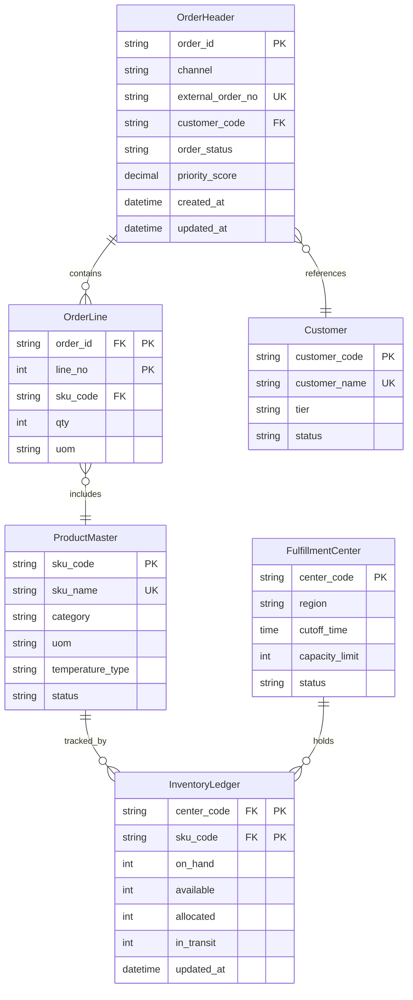

# DB Schema Definition - Order Management System

## 작성자
- 작성자: DB/Data Expert Agent
- 작성일: 2026-04-10
- 버전: v1.0

## 목적 (Purpose)
본 문서는 주문-배송 통합 시스템(OMS/WMS)의 핵심 데이터 구조를 정의합니다. 개발팀이 데이터베이스 설계 및 구현에 필요한 엔터티, 속성, 관계, 제약조건, 유효성 규칙을 일관되게 제시합니다.

## 대상 (Audience)
- 데이터베이스 엔지니어 (구현 및 DDL 작성)
- 백엔드 개발팀 (SQL 쿼리 작성, 데이터 무결성 검증)
- QA/테스트팀 (테스트 데이터 설계, 유효성 규칙 검증)
- 시스템 운영자 (데이터 정합성, 백업 정책)

## 목차 (Table of Contents)
1. [개요](#개요)
2. [엔터티 설계](#엔터티-설계)
3. [관계도 (ERD)](#관계도-erd)
4. [데이터 유효성 규칙](#데이터-유효성-규칙)
5. [마스터 데이터 초기값](#마스터-데이터-초기값)
6. [변경 이력](#변경-이력)
7. [승인 현황](#승인-현황)

---

## 개요

### 설계 범위
- **OMS (Order Management System)**: 주문 수집, 우선순위 산정, 라우팅, 배송지 결정
- **WMS (Warehouse Management System)**: 입고, 출고, 재고 관리
- **Master Data Hub**: 고객, 상품, 센터 마스터 데이터
- **Inventory Ledger**: 실시간 재고 현황 관리

### 설계 원칙
- 정규화: 3정규형 기준 (일부 성능 최적화용 비정규화 컬럼 포함)
- 식별자: 내부 PK는 UUID, 업무번호는 별도 유니크 컬럼으로 분리
- 관계: FK는 데이터 무결성 보장, Cascade 정책 명시
- 상태 관리: 상태코드는 별도 정의, 상태 전이는 애플리케이션에서 검증
- 시간 정보: 모든 날짜/시간은 UTC 저장, ISO-8601 포맷

---

## 엔터티 설계

### 2.1 OrderHeader (주문 헤더)

**설명**: 채널별로 수집된 주문의 상위 개체. 주문번호, 채널, 고객, 상태, 우선순위 정보를 관리합니다.

**주요 관계**:
- 1:N → OrderLine (주문 라인)
- N:1 ← Customer (고객 마스터)

**생명주기**:
- RECEIVED (수신) → ROUTED (라우팅완료) → ALLOCATED (할당완료) → SHIPPING (배송중) → COMPLETED (완료)

| 필드 | 한글명 | 타입 | 길이 | NULL | PK | FK | UK | 기본값 | 설명 |
|---|---|---|---:|---|---|---|---|---|---|
| order_id | 내부주문ID | VARCHAR | 36 | N | Y |  |  |  | UUID 형식, 시스템 자동 생성 |
| channel | 주문채널 | VARCHAR | 20 | N |  |  |  |  | ENUM: B2B_PORTAL, MARKETPLACE, EDI, MANUAL |
| external_order_no | 외부주문번호 | VARCHAR | 64 | N |  |  | Y |  | 채널 내 유일, 멱등성 키 |
| customer_code | 고객코드 | VARCHAR | 32 | N |  | Y |  |  | Customer 마스터 참조 |
| order_status | 주문상태 | VARCHAR | 20 | N |  |  |  | RECEIVED | 상태코드값 |
| priority_score | 우선순위점수 | DECIMAL | 5,2 | N |  |  |  | 0 | 0~100 범위, 높을수록 긴급 |
| created_at | 생성시각 | TIMESTAMP | - | N |  |  |  | CURRENT_TIMESTAMP | UTC 저장 |
| updated_at | 수정시각 | TIMESTAMP | - | N |  |  |  | CURRENT_TIMESTAMP | 마지막 상태변경 시각 |

**제약조건**:
- PK: order_id
- FK: customer_code → Customer(customer_code)
- UK: (channel, external_order_no)
- CHECK: priority_score BETWEEN 0 AND 100

**인덱스**:
- INDEX idx_order_channel_ext (channel, external_order_no) — 채널별 외부번호 조회
- INDEX idx_order_customer (customer_code) — 고객별 주문 조회
- INDEX idx_order_created (created_at DESC) — 최신 주문 조회
- INDEX idx_order_status (order_status) — 상태별 주문 조회

---

### 2.2 OrderLine (주문 라인)

**설명**: OrderHeader에 포함된 개별 상품/수량 정보입니다.

**주요 관계**:
- N:1 → OrderHeader (주문 헤더)
- N:1 ← ProductMaster (상품 마스터)

| 필드 | 한글명 | 타입 | 길이 | NULL | PK | FK | 설명 |
|---|---|---|---:|---|---|---|---|
| order_id | 주문ID | VARCHAR | 36 | N | Y |  | OrderHeader 참조 |
| line_no | 라인번호 | INT | - | N | Y |  | 주문 내 순서 (1부터 시작) |
| sku_code | SKU코드 | VARCHAR | 32 | N |  | Y | ProductMaster 참조 |
| qty | 수량 | INT | - | N |  |  | 양수만 허용 |
| uom | 단위 | VARCHAR | 8 | N |  |  | EA, KG, BOX 등 코드값 |

**제약조건**:
- PK: (order_id, line_no)
- FK: order_id → OrderHeader(order_id)
- FK: sku_code → ProductMaster(sku_code)
- CHECK: qty > 0

**인덱스**:
- INDEX idx_orderline_sku (sku_code) — SKU별 주문라인 조회

---

### 2.3 ProductMaster (상품 마스터)

**설명**: 판매 가능한 모든 상품의 기본 정보입니다. Master Data Hub 관리 대상.

**주요 관계**:
- 1:N → OrderLine (주문 라인)
- 1:N → InventoryLedger (재고 원장)

| 필드 | 한글명 | 타입 | 길이 | NULL | PK | FK | UK | 설명 |
|---|---|---|---:|---|---|---|---|---|
| sku_code | SKU코드 | VARCHAR | 32 | N | Y |  |  | 패턴: ^[A-Z0-9-]+$ |
| sku_name | 상품명 | VARCHAR | 120 | N |  |  | Y | 공백 불가 |
| category | 카테고리 | VARCHAR | 40 | N |  |  |  | FRUIT, DAIRY, FROZEN 등 |
| uom | 기본단위 | VARCHAR | 8 | N |  |  |  | EA, KG, BOX 등 |
| temperature_type | 온도유형 | VARCHAR | 16 | Y |  |  |  | CHILLED, FROZEN, AMBIENT |
| status | 상태 | VARCHAR | 16 | N |  |  |  | ACTIVE, INACTIVE, DEPRECATED |

**제약조건**:
- PK: sku_code
- UK: sku_name
- CHECK: status IN ('ACTIVE', 'INACTIVE', 'DEPRECATED')

**인덱스**:
- INDEX idx_product_category (category) — 카테고리별 상품 조회
- INDEX idx_product_status (status) — 상태별 상품 조회

---

### 2.4 InventoryLedger (재고 원장)

**설명**: 각 센터별 상품의 실시간 재고 현황을 관리합니다. 가용재고 조회 성능이 중요한 테이블.

**주요 관계**:
- N:1 ← ProductMaster (상품 마스터)
- N:1 ← FulfillmentCenter (센터 마스터)

| 필드 | 한글명 | 타입 | 길이 | NULL | PK | FK | 설명 |
|---|---|---|---:|---|---|---|---|
| center_code | 센터코드 | VARCHAR | 16 | N | Y |  | FulfillmentCenter 참조 |
| sku_code | SKU코드 | VARCHAR | 32 | N | Y |  | ProductMaster 참조 |
| on_hand | 총재고 | INT | - | N |  |  | on_hand = available + allocated + in_transit |
| available | 가용재고 | INT | - | N |  |  | 출고 가능한 수량 |
| allocated | 할당재고 | INT | - | N |  |  | 주문에 할당된 수량 |
| in_transit | 이동중재고 | INT | - | N |  |  | 입고 대기 또는 이동 중 수량 |
| updated_at | 최종갱신시각 | TIMESTAMP | - | N |  |  | UTC 저장, 실시간 갱신 |

**제약조건**:
- PK: (center_code, sku_code)
- FK: center_code → FulfillmentCenter(center_code)
- FK: sku_code → ProductMaster(sku_code)
- CHECK: on_hand >= 0, available >= 0, allocated >= 0, in_transit >= 0
- CHECK: on_hand = available + allocated + in_transit (무결성 규칙)

**인덱스**:
- INDEX idx_inventory_available (center_code, sku_code, available DESC) — 가용재고 실시간 조회 (성능 중요)
- INDEX idx_inventory_updated (updated_at DESC) — 최근 갱신 데이터 조회

**성능 고려사항**:
- API 응답 95p 300ms 이내를 위해 읽기 전용 캐시(TTL 3초) 운영 권장
- 대량 재고 변경 시 배치 갱신으로 성능 확보

---

### 2.5 FulfillmentCenter (출고 센터 마스터)

**설명**: 주문 처리 가능한 물류센터 정보입니다. Master Data Hub 관리 대상.

| 필드 | 한글명 | 타입 | 길이 | NULL | PK | FK | 설명 |
|---|---|---|---:|---|---|---|---|
| center_code | 센터코드 | VARCHAR | 16 | N | Y |  | 고유 센터 식별자 |
| region | 지역코드 | VARCHAR | 20 | N |  |  | KR-SEOUL, KR-BUSAN 등 |
| cutoff_time | 컷오프시간 | TIME | - | N |  |  | HH:MM:SS 형식 |
| capacity_limit | 용량한도 | INT | - | N |  |  | 일일 최대 처리 건수 |
| status | 상태 | VARCHAR | 16 | N |  |  | ACTIVE, INACTIVE, MAINTENANCE |

**제약조건**:
- PK: center_code
- CHECK: status IN ('ACTIVE', 'INACTIVE', 'MAINTENANCE')

---

### 2.6 Customer (고객 마스터)

**설명**: 주문 발주처의 고객 정보입니다. Master Data Hub 관리 대상.

| 필드 | 한글명 | 타입 | 길이 | NULL | PK | 설명 |
|---|---|---|---:|---|---|---|
| customer_code | 고객코드 | VARCHAR | 32 | N | Y | 고유 고객 식별자 |
| customer_name | 고객명 | VARCHAR | 120 | N |  |  |
| tier | 고객등급 | VARCHAR | 16 | N |  | VIP, STANDARD, BASIC |
| status | 상태 | VARCHAR | 16 | N |  | ACTIVE, INACTIVE, SUSPENDED |

---

## 관계도 (ERD)

---

## 데이터 유효성 규칙

### 3.1 코드 포맷 규칙
- **코드형 키**: 정규식 `^[A-Z0-9-]+$` (대문자, 숫자, 하이픈만 허용)
  - 예: `SKU-APPLE-01`, `FC-SEOUL-01`, `CUST-001`
- **채널 코드**: `B2B_PORTAL`, `MARKETPLACE`, `EDI`, `MANUAL` (정확한 문자열만)

### 3.2 시간 정보 규칙
- **저장**: 모든 TIMESTAMP는 UTC 표준시로 저장
- **API**: 클라이언트로 반환할 때는 ISO-8601 형식 (예: `2026-04-10T15:30:00Z`)
- **시간대**: 시스템은 UTC 기준, 클라이언트가 로컬 시간으로 변환

### 3.3 참조 무결성 규칙
- `OrderLine.sku_code` → `ProductMaster.sku_code` 반드시 존재
- `OrderHeader.customer_code` → `Customer.customer_code` 반드시 존재
- `InventoryLedger.sku_code` → `ProductMaster.sku_code` 반드시 존재
- `InventoryLedger.center_code` → `FulfillmentCenter.center_code` 반드시 존재

### 3.4 상태값 유효성
- **OrderHeader.order_status**: 상태 머신 검증, 정의된 전이만 허용
  - 허용 전이: RECEIVED → ROUTED → ALLOCATED → SHIPPING → COMPLETED
  - 예외 상태: BACKORDER_REQUESTED, CANCELLED, EXCEPTION
- **ProductMaster.status**: ACTIVE, INACTIVE, DEPRECATED만 허용
- **Customer.status**: ACTIVE, INACTIVE, SUSPENDED만 허용

### 3.5 데이터 범위 규칙
- `OrderHeader.priority_score`: 0~100 범위 (정수가 아니어도 됨, 최대 2자리 소수)
- `OrderLine.qty`, `InventoryLedger.on_hand` 등 수량: 양수만 허용 (>= 0 또는 > 0)
- `InventoryLedger`: on_hand = available + allocated + in_transit 무조건 만족

### 3.6 유니크 제약
- `OrderHeader`: (channel, external_order_no) 복합 유니크 — 채널별 멱등성
- `ProductMaster`: sku_name 유니크 — 상품명 중복 방지
- `Customer`: customer_name 유니크 — 고객명 중복 방지

---

## 마스터 데이터 초기값

### 5.1 상품 (ProductMaster) 초기값

| sku_code | sku_name | category | uom | temperature_type | status |
|---|---|---|---|---|---|
| SKU-APPLE-01 | Apple 1kg Box | FRUIT | EA | AMBIENT | ACTIVE |
| SKU-BANANA-01 | Banana 1kg Box | FRUIT | EA | AMBIENT | ACTIVE |
| SKU-MILK-01 | Fresh Milk 1L | DAIRY | EA | CHILLED | ACTIVE |
| SKU-BEEF-01 | Beef Frozen 1kg | MEAT | KG | FROZEN | ACTIVE |

### 5.2 센터 (FulfillmentCenter) 초기값

| center_code | region | cutoff_time | capacity_limit | status |
|---|---|---|---:|---|
| FC-SEOUL-01 | KR-SEOUL | 17:00:00 | 200000 | ACTIVE |
| FC-BUSAN-01 | KR-BUSAN | 16:00:00 | 120000 | ACTIVE |
| FC-DAEGU-01 | KR-DAEGU | 16:30:00 | 80000 | ACTIVE |

### 5.3 고객 (Customer) 초기값

| customer_code | customer_name | tier | status |
|---|---|---|---|
| CUST-001 | Alpha Retail | VIP | ACTIVE |
| CUST-002 | Beta Mart | STANDARD | ACTIVE |
| CUST-003 | Gamma Store | BASIC | ACTIVE |

---

## 변경 이력 (Change Log)

| 버전 | 날짜 | 변경 내용 | 작성자 |
|---|---|---|---|
| v1.0 | 2026-04-10 | 초안 작성 (OrderHeader, OrderLine, ProductMaster, InventoryLedger, FulfillmentCenter, Customer 엔터티 정의) | DB/Data Expert Agent |

---

## 승인 현황 (Approvals)

- [ ] 데이터베이스 엔지니어 검토
- [ ] 백엔드 개발팀 검토
- [ ] 개발 PM 최종 승인

---

## 추가 참고사항

### 논리삭제 정책
현재 설계에서는 모든 마스터 데이터(`ProductMaster`, `Customer`, `FulfillmentCenter`)에 `status` 컬럼을 포함하여 논리삭제를 구현합니다. 
- 삭제 필요 시: `status = 'INACTIVE'` 또는 `status = 'DEPRECATED'`로 변경
- 물리삭제는 수행하지 않음 (감사 및 이력 추적 목적)

### 버전 관리
향후 우선순위 가중치(`slaWeight`, `vipWeight` 등)와 상태 전이 규칙이 변경될 경우 별도의 설정 테이블(`priority_config`, `status_transition_rule`) 추가를 검토합니다.

### 성능 최적화
- `InventoryLedger` 조회 성능: 읽기 캐시(TTL 3초) 운영
- 대량 주문 처리: 배치 기능 및 인덱스 활용
- 모니터링: 주문 생성 지연 5분 초과, 재고 조회 응답 300ms 초과 시 알림

