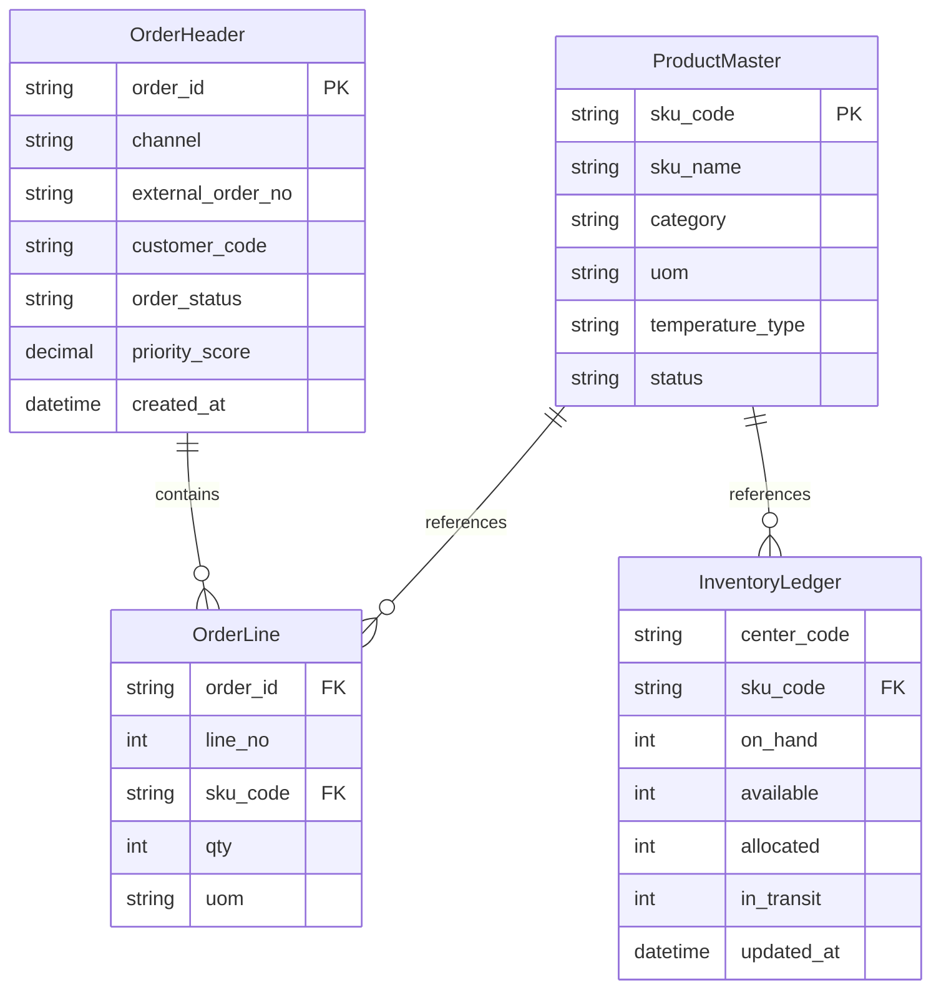

# OMS/WMS 데이터 스키마 정의

## 작성자
- 작성자: 아키텍처 에이전트
- 작성일: 2026-04-10
- 버전: v1.0

## 목적 (Purpose)
OMS(Order Management System)와 WMS(Warehouse Management System)의 핵심 데이터 모델, 엔티티 관계, 유효성 규칙을 정의하여 데이터베이스 설계 및 구현의 기준을 제공한다.

## 대상 (Audience)
- 데이터베이스 설계자: 스키마 설계
- 백엔드 개발자: ORM 매핑
- DBA: 성능 최적화, 인덱싱
- 데이터 엔지니어: ETL/마이그레이션

## 목차
1. 엔티티 속성 정의
2. 엔티티 관계도 (ERD)
3. 데이터 유효성 규칙
4. 마스터 데이터 초기값

---

## 1. 엔티티 속성 정의

### 1.1 OrderHeader
| 필드 | 타입 | 길이 | 필수 | 설명 | 유효성 |
|---|---|---:|---|---|---|
| order_id | VARCHAR | 36 | Y | 내부 주문 ID | UUID |
| channel | VARCHAR | 20 | Y | 주문 채널 | ENUM |
| external_order_no | VARCHAR | 64 | Y | 외부 주문번호 | channel 내 유일 |
| customer_code | VARCHAR | 32 | Y | 고객 코드 | MDH 존재 |
| order_status | VARCHAR | 20 | Y | 주문 상태 | 상태머신 검증 |
| priority_score | DECIMAL | 5,2 | Y | 우선순위 점수 | 0~100 |
| created_at | TIMESTAMP | - | Y | 생성시각 | ISO-8601 |

### 1.2 OrderLine
| 필드 | 타입 | 길이 | 필수 | 설명 | 유효성 |
|---|---|---:|---|---|---|
| order_id | VARCHAR | 36 | Y | 주문 ID | FK(OrderHeader) |
| line_no | INT | - | Y | 라인번호 | >0 |
| sku_code | VARCHAR | 32 | Y | SKU 코드 | MDH 존재 |
| qty | INT | - | Y | 수량 | >0 |
| uom | VARCHAR | 8 | Y | 단위 | 코드값 |

### 1.3 InventoryLedger
| 필드 | 타입 | 길이 | 필수 | 설명 | 유효성 |
|---|---|---:|---|---|---|
| center_code | VARCHAR | 16 | Y | 센터코드 | MDH 존재 |
| sku_code | VARCHAR | 32 | Y | SKU 코드 | MDH 존재 |
| on_hand | INT | - | Y | 총재고 | >=0 |
| available | INT | - | Y | 가용재고 | >=0 |
| allocated | INT | - | Y | 할당재고 | >=0 |
| in_transit | INT | - | Y | 이동중재고 | >=0 |
| updated_at | TIMESTAMP | - | Y | 최종갱신시각 | ISO-8601 |

### 1.4 ProductMaster
| 필드 | 타입 | 길이 | 필수 | 설명 | 유효성 |
|---|---|---:|---|---|---|
| sku_code | VARCHAR | 32 | Y | SKU 코드 | PK, 패턴 검증 |
| sku_name | VARCHAR | 120 | Y | SKU 명 | 공백 불가 |
| category | VARCHAR | 40 | Y | 카테고리 | 코드값 |
| uom | VARCHAR | 8 | Y | 기본단위 | 코드값 |
| temperature_type | VARCHAR | 16 | N | 온도유형 | CHILLED/FROZEN/AMBIENT |
| status | VARCHAR | 16 | Y | 상태 | ACTIVE/INACTIVE/DEPRECATED |

## 2. 엔티티 관계도 (ERD)

## 3. 데이터 유효성 규칙

### 3.1 코드형 필드
- 패턴: 정규식 `^[A-Z0-9-]+$`
- 대문자, 숫자, 하이픈만 허용
- 영문 소문자, 공백, 특수문자 불가

### 3.2 날짜/시간
- 저장 형식: UTC (Coordinated Universal Time)
- API 응답 형식: ISO-8601 (예: 2026-04-10T09:10:11Z)
- 시간대 정보 포함 필수

### 3.3 참조 무결성
- `OrderLine.sku_code` → `ProductMaster.sku_code` 존재 필수
- `OrderHeader.customer_code` → Customer 마스터 존재 필수
- `InventoryLedger.center_code` → FulfillmentCenter 마스터 존재 필수
- Foreign Key 제약 활성화

### 3.4 상태값 관리
- Enum으로 관리: `ACTIVE`, `INACTIVE`, `DEPRECATED`
- 정의된 상태 전이 외 변경 금지
- 이력 관리 필요

## 4. 마스터 데이터 초기값

### 4.1 Product
| sku_code | sku_name | category | uom | status |
|---|---|---|---|---|
| SKU-APPLE-01 | Apple 1kg Box | FRUIT | EA | ACTIVE |
| SKU-BANANA-01 | Banana 1kg Box | FRUIT | EA | ACTIVE |

### 4.2 FulfillmentCenter
| center_code | region | cutoff_time | capacity_limit | status |
|---|---|---|---:|---|
| FC-SEOUL-01 | KR-SEOUL | 17:00:00 | 200000 | ACTIVE |
| FC-BUSAN-01 | KR-BUSAN | 16:00:00 | 120000 | ACTIVE |

### 4.3 Customer
| customer_code | customer_name | tier | status |
|---|---|---|---|
| CUST-001 | Alpha Retail | VIP | ACTIVE |
| CUST-002 | Beta Mart | STANDARD | ACTIVE |

## 변경 이력 (Change Log)
- v1.0 (2026-04-10): 초안 작성 (정책 준수 문서로 재정리)

## 승인 현황 (Approvals)
- [ ] DBA 검토
- [ ] 개발팀 검토
- [ ] 데이터 엔지니어 검토
