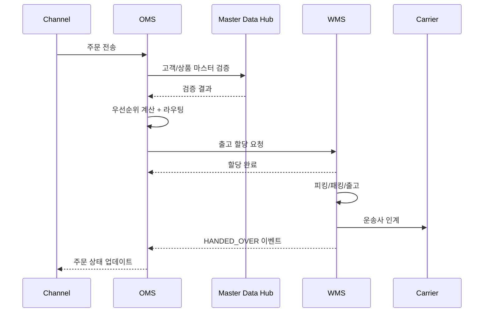

# OMS WMS Process Flow Specification

## 작성자
- 작성자: 기획자 Agent
- 작성일: 2026-04-13
- 버전: v1.0

## 목적 (Purpose)
주문 수집부터 출고 인계까지 OMS-WMS 연계 프로세스와 예외 흐름을 정의한다.

## 대상 (Audience)
기획, 백엔드, QA, 운영

## 목차 (Table of Contents)
- 1. End-to-End 표준 흐름
- 2. 단계별 입출력
- 3. 예외 처리
- 4. 통합 시퀀스
- 5. 운영 체크포인트

## 주요 내용

### 1. End-to-End 표준 흐름
1. OMS가 채널 주문을 수집하고 유효성 검사를 수행한다.
2. OMS가 우선순위를 산정하고 라우팅 엔진으로 센터를 결정한다.
3. OMS가 WMS로 출고 할당 요청을 전송한다.
4. WMS가 피킹, 패킹, 출고를 수행한다.
5. 운송사 인계 후 WMS가 OMS로 이벤트를 전송한다.
6. OMS가 주문 상태를 `DELIVERING` 또는 `COMPLETED`로 갱신한다.

### 2. 단계별 입출력
| 단계 | 입력 | 출력 | 소유 시스템 |
|---|---|---|---|
| 주문 수집 | 채널 주문 JSON/CSV/EDI | 내부 주문번호, RECEIVED 상태 | OMS |
| 우선순위 산정 | 주문 헤더, 고객등급, SLA | priorityScore, priorityClass | OMS |
| 라우팅 | 주문, 재고요약, 컷오프정보 | centerCode/분할계획, reasonCode | OMS |
| 출고 할당 | orderId, lineItems, centerCode | allocationId, ALLOCATED 상태 | WMS |
| 피킹/패킹 | allocationId | PACKED 상태, 박스 정보 | WMS |
| 출고/인계 | shipmentNo, 송장 | SHIPPED/HANDED_OVER 이벤트 | WMS -> OMS |

### 3. 예외 처리
- 재고 부족:
  - 조건: 대상 센터 가용재고 < 주문수량
  - 처리: 대체 센터 탐색, 실패 시 `BACKORDER_REQUESTED`, 고객 알림 이벤트 발행
- 라우팅 실패:
  - 조건: 규칙 충돌 또는 전체 센터 컷오프 초과
  - 처리: 폴백 센터 적용, 실패 시 수동 검토 큐 등록
- 출고 검수 실패:
  - 조건: 피킹 수량 불일치, 파손
  - 처리: WMS `EXCEPTION` 이벤트 발행, OMS 재피킹/부분출고 판단

### 4. 통합 시퀀스

### 5. 운영 체크포인트
- OMS 수집 지연 5분 초과 시 신규 수집 제한 모드 전환
- WMS 피킹 실패율 2% 초과 시 파동 크기 자동 축소
- 이벤트 실패 재시도: 1분 간격, 최대 10회
- 10회 초과 실패 시 DLQ 적재 후 수동 처리 큐 등록

## 변경 이력 (Change Log)
- v1.0 (2026-04-13): 문서 정책 포맷으로 재정비 및 WJA-18 프로세스 반영

## 승인 현황 (Approvals)
- [ ] PM 검토
- [ ] 기획/개발/QA 검토
