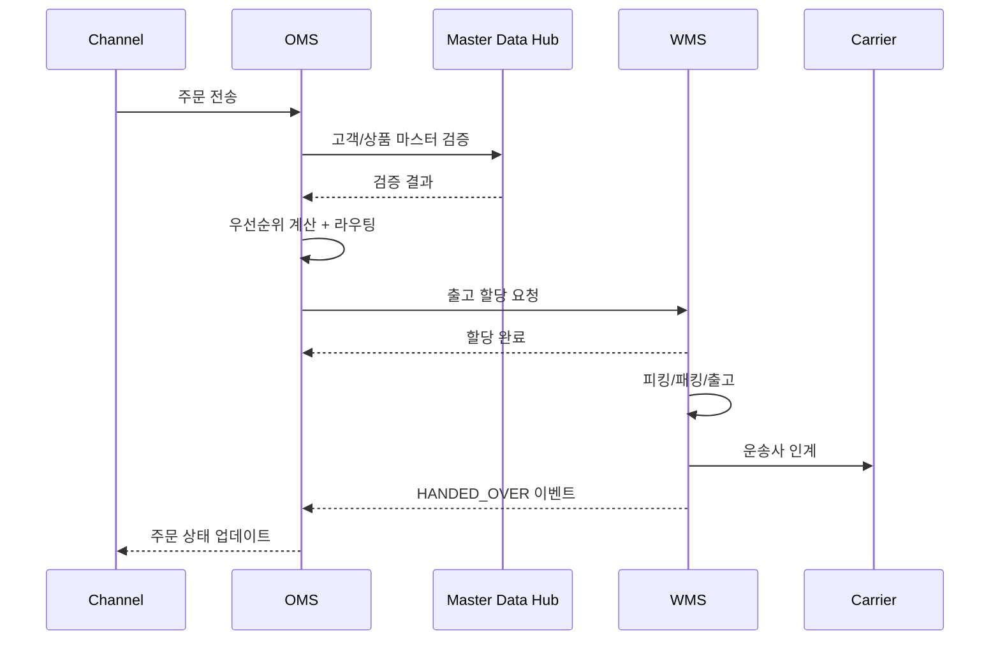

# OMS/WMS Order-Delivery Process Flow v1

## 작성자
- 작성자: 기획자 에이전트
- 작성일: 2026-04-10
- 버전: v1.0

## 목적 (Purpose)
주문 수집부터 배송 인계까지의 정상/예외 흐름과 시스템 간 책임 경계를 정의한다.

## 대상 (Audience)
기획, 개발, QA, 운영

## 목차 (Table of Contents)
1. End-to-End 절차
2. 예외 처리 프로세스
3. 통합 시퀀스 다이어그램
4. 운영 체크포인트

## 주요 내용

### 1. End-to-End 절차

#### 1.1 표준 주문-배송 플로우
1. OMS가 채널 주문을 수집하고 유효성 검사를 수행
2. OMS가 우선순위를 산정하고 라우팅 엔진으로 센터를 결정
3. OMS가 WMS에 출고 할당 요청을 전송
4. WMS가 피킹/패킹/출고를 수행
5. 운송사 인계 후 OMS로 출고 확정 이벤트를 전송
6. OMS가 주문 상태를 `DELIVERING` 또는 `COMPLETED`로 갱신

#### 1.2 단계별 입출력
| 단계 | 입력 | 출력 | 소유 시스템 |
|---|---|---|---|
| 주문 수집 | 채널 주문 JSON/CSV/EDI | 내부 주문번호, `RECEIVED` | OMS |
| 우선순위 | 주문 헤더, 고객등급, SLA | priorityScore, priorityClass | OMS |
| 라우팅 | 주문, 재고요약, 컷오프 | centerCode/분할계획, reasonCode | OMS |
| 출고 할당 | orderId, lineItems, centerCode | allocationId, `ALLOCATED` | WMS |
| 피킹/패킹 | allocationId | `PACKED`, 박스 정보 | WMS |
| 출고/인계 | shipmentNo, 송장 | `SHIPPED`/`HANDED_OVER` 이벤트 | WMS -> OMS |

### 2. 예외 처리 프로세스

#### 2.1 재고 부족
- 조건: 라우팅 대상 센터 가용재고 < 주문수량
- 처리:
  - OMS 대체 센터 재탐색
  - 실패 시 `BACKORDER_REQUESTED` 전환
  - 고객 알림 이벤트 발행

#### 2.2 라우팅 실패
- 조건: 룰 충돌 또는 전 센터 컷오프 초과
- 처리:
  - 폴백 룰(고정 우선순위 센터) 적용
  - 실패 시 수동 검토 큐 등록
  - 운영자 알림 + 장애 카운터 증가

#### 2.3 출고 중 검수 실패
- 조건: 피킹 수량 불일치 또는 파손
- 처리:
  - WMS `EXCEPTION` 이벤트 발행
  - OMS 부분출고 가능 여부 평가
  - 필요 시 재피킹 요청 생성

### 3. 통합 시퀀스 다이어그램

### 4. 운영 체크포인트
- OMS 수집 지연 5분 초과 시 신규 수집 제한 모드 전환
- WMS 피킹 실패율 2% 초과 시 파동 크기 자동 축소
- 이벤트 전송 실패 재시도: 1분 간격, 최대 10회
- 10회 실패 시 DLQ 적재 및 수동 처리 큐 등록

## 변경 이력 (Change Log)
- v1.0 (2026-04-10): WJA-23 정책 형식으로 문서 재정비

## 승인 현황 (Approvals)
- [ ] PM 검토
- [ ] 기획/개발/운영 검토
