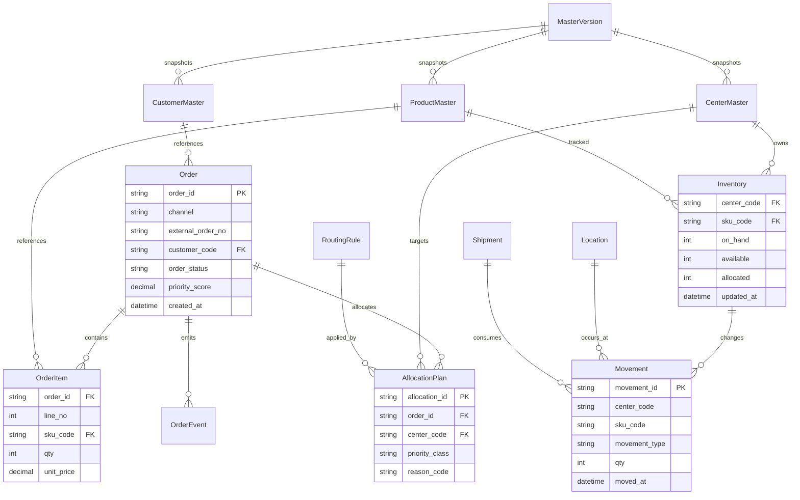
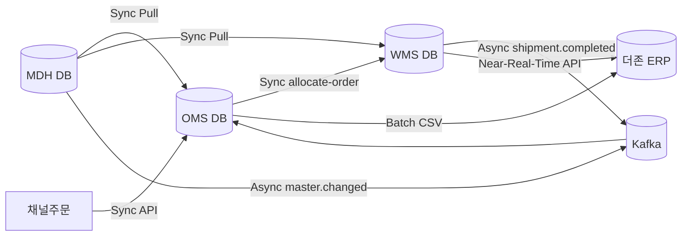

# WJA-20 데이터 모델 개요 (OMS/WMS/MDH/ERP)

## 1. 데이터 모델링 원칙
- 트랜잭션 원장과 조회 모델 분리(OLTP + Read Model)
- 시스템 경계별 소유 데이터 명확화(OMS, WMS, MDH)
- 연계 데이터는 Outbox/Inbox 패턴으로 추적 가능하게 설계
- 개인정보(PII)는 최소 수집/암호화/마스킹 기본 적용

## 2. 핵심 엔터티 요약

### 2.1 OMS
| 엔터티 | 설명 | 주요 키 | 비고 |
|---|---|---|---|
| Order | 주문 헤더 | order_id | 채널 주문의 표준 헤더 |
| OrderItem | 주문 라인 | order_id + line_no | SKU/수량/단가 |
| AllocationPlan | 출고 할당 계획 | allocation_id | 센터/우선순위/할당근거 |
| OrderEvent | 주문 이벤트 이력 | event_id | 상태 전이 추적 |

### 2.2 WMS
| 엔터티 | 설명 | 주요 키 | 비고 |
|---|---|---|---|
| Inventory | 재고 집계 | center_code + sku_code | on_hand/available/allocated |
| Movement | 재고 이동 원장 | movement_id | 입고/출고/조정/이동 |
| Location | 로케이션 마스터 | location_id | Zone/Bin 관리 |
| Shipment | 출고/송장 | shipment_id | 운송사 인계 정보 |
| BarcodeTask | PDA 작업지시 | task_id | 피킹/검수/적치 태스크 |

### 2.3 Master Data Hub
| 엔터티 | 설명 | 주요 키 | 비고 |
|---|---|---|---|
| ProductMaster | 상품 마스터 | sku_code | UOM/카테고리/상태 |
| CustomerMaster | 고객 마스터 | customer_code | 등급/과세/청구조건 |
| CenterMaster | 센터 마스터 | center_code | 권역/컷오프/용량 |
| RoutingRule | 라우팅 규칙 | rule_id | 조건식/우선순위/유효기간 |
| MasterVersion | 배포 버전 | version_id | 스냅샷/차분 배포 기준 |

## 3. 통합 ERD

## 4. 개인정보/민감정보 처리 지점
| 데이터 | 저장 시스템 | 보호 방식 | 조회 정책 |
|---|---|---|---|
| 수취인명/연락처/주소 | OMS Order | 컬럼 암호화(AES-256) | 운영화면 마스킹 |
| 운송장 수령자정보 | WMS Shipment | 토큰화 + 최소보관 | 출고 후 90일 파기 |
| 고객 정산정보 | ERP 연계 데이터 | 전송구간 TLS/mTLS | 재무권한자만 조회 |

## 5. 동기/비동기 데이터 흐름

## 6. 인덱스/파티셔닝 전략
- OMS
  - `uq_order_channel_external(channel, external_order_no)`
  - `idx_order_status_created(order_status, created_at)`
  - 주문 이벤트 테이블 월 단위 파티셔닝
- WMS
  - `pk_inventory(center_code, sku_code)`
  - `idx_movement_center_time(center_code, moved_at)`
  - Movement는 일 단위 파티셔닝 + 13개월 보관
- MDH
  - `uq_master_version(domain, version_no)`
  - 유효기간 조회 인덱스 `idx_rule_effective(effective_from, effective_to)`

## 7. 정합성/복구 정책
- Outbox 이벤트는 DB 커밋과 동일 트랜잭션으로 기록
- 소비 측은 Inbox 테이블로 멱등 처리(`event_id` unique)
- ERP ACK 미수신건은 `integration_pending` 상태로 유지 후 재처리
- 일배치 종료 후 주문/출고/재고 건수 대사 리포트 자동 생성
