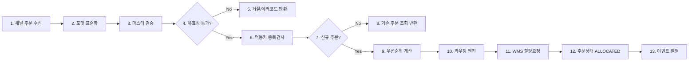
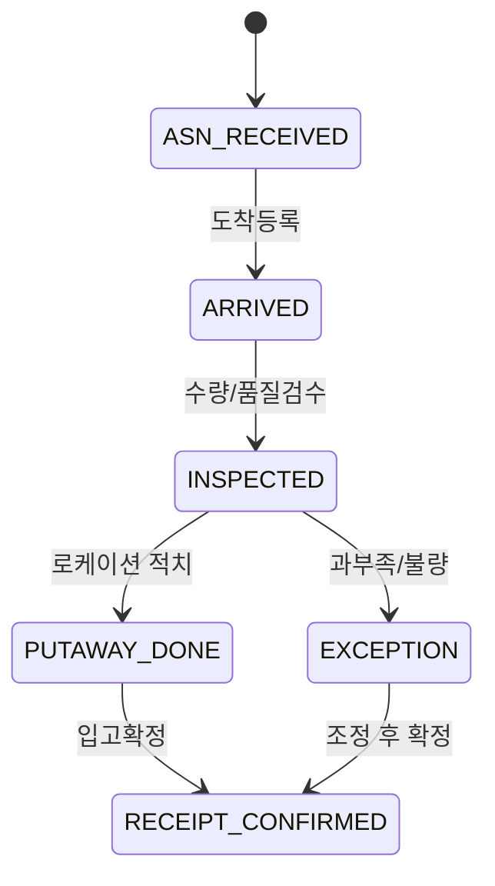
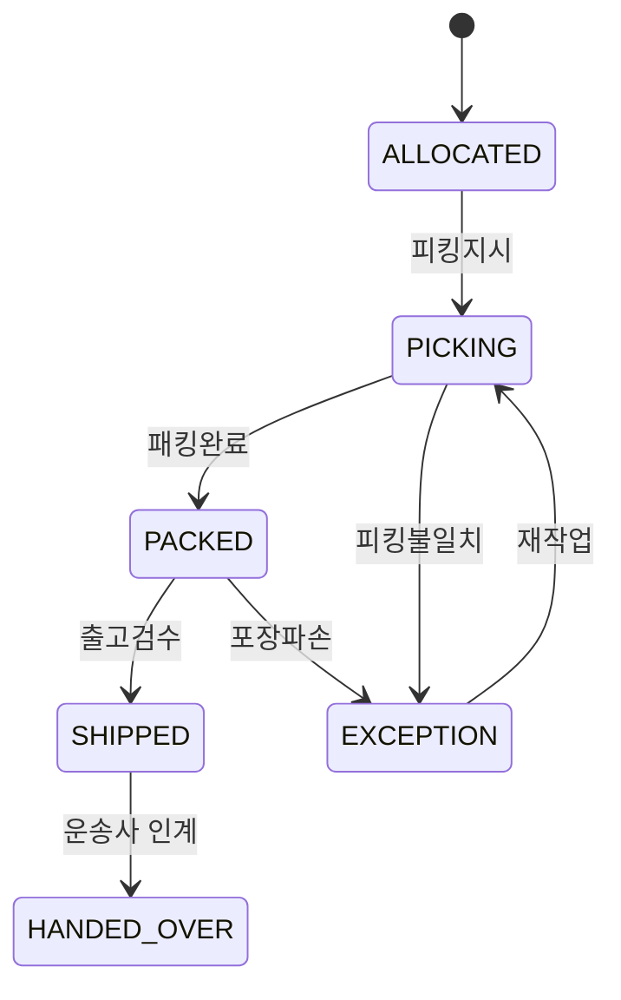
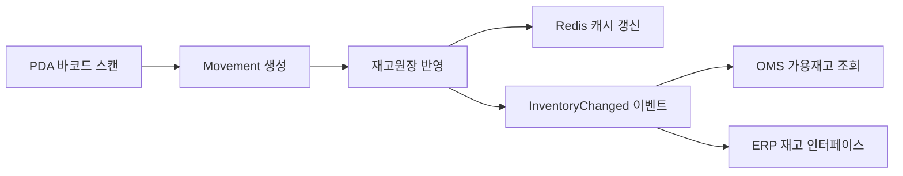
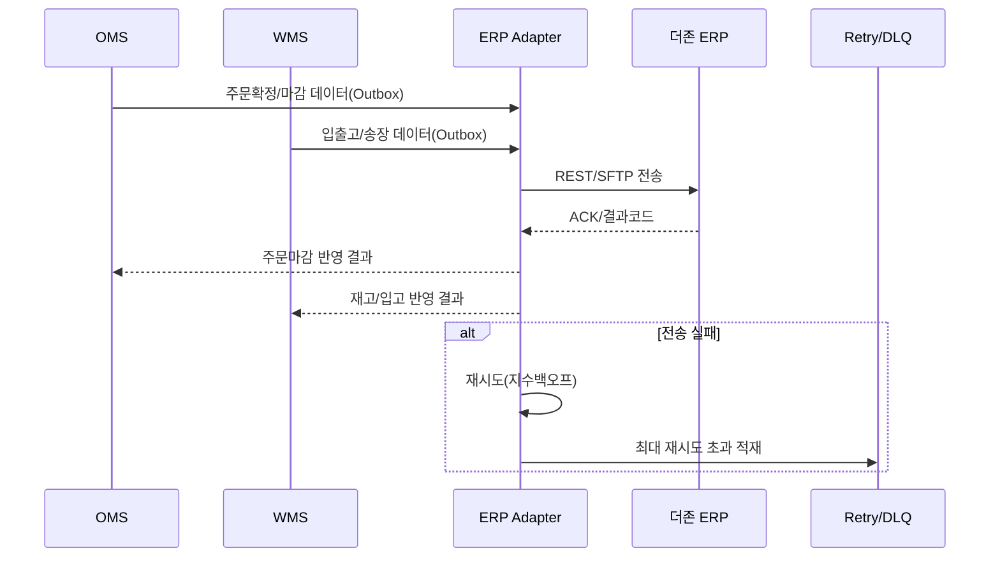
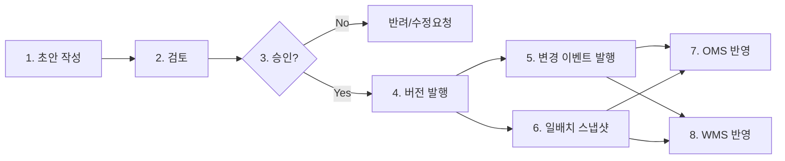

# WJA-20 시스템별 프로세스 흐름도

## 1. OMS 주문 수집/할당 상세 프로세스

### 1.1 표준 플로우

### 1.2 예외 플로우
- 재고 부족: 대체센터 재탐색 -> 실패 시 `BACKORDER_REQUESTED`
- 라우팅 불가: 폴백 룰 적용 -> 실패 시 수동검토 큐
- 채널 중복 전송: 멱등 처리 후 기존 결과 재응답

## 2. WMS 입출고/재고 상세 프로세스

### 2.1 입고 프로세스

### 2.2 출고 프로세스

### 2.3 재고 데이터 흐름

## 3. ERP 연계 프로세스

### 3.1 송장/입고/마감 연계 시퀀스

### 3.2 동기화 정책
- 실시간: 중요 이벤트(출고확정, 재고조정, 마감확정) 즉시 전송
- 배치: 일 마감 파일 `D+1 00:10` 생성 후 전송
- 정합성: ERP ACK 기준으로 상태 확정, 미수신건은 보류 큐

## 4. Master Data Hub 프로세스

### 4.1 마스터 승인/배포

### 4.2 데이터 품질 기준
- 코드 규칙: `^[A-Z0-9-]+$`
- 유효기간: `effective_from <= effective_to`
- 참조무결성: 고객/상품/센터 참조 키 사전 검증
- 배포 차단: 품질 규칙 실패 시 승인 불가

## 5. 운영 체크포인트
- OMS 수집 실패율 1% 초과 시 채널별 제한 모드
- WMS 재고정합률 99.5% 미만 시 실사 태스크 자동 생성
- ERP 연계 누락건 10분 이상 적체 시 온콜 알림
- MDH 배포 실패 시 이전 안정버전 자동 롤백
