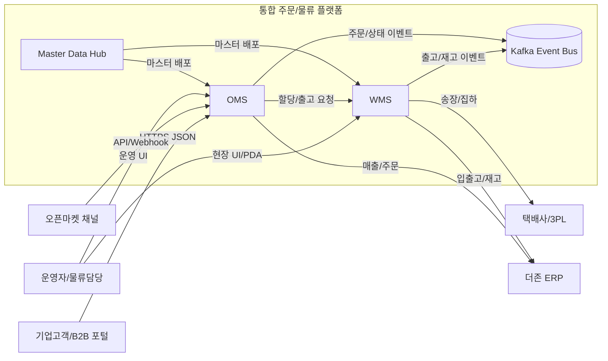
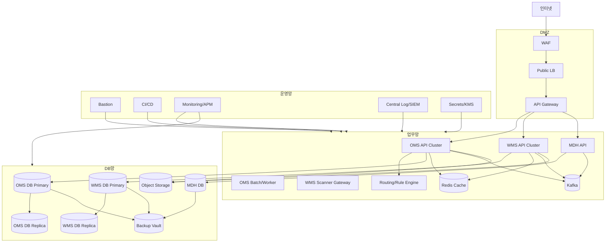
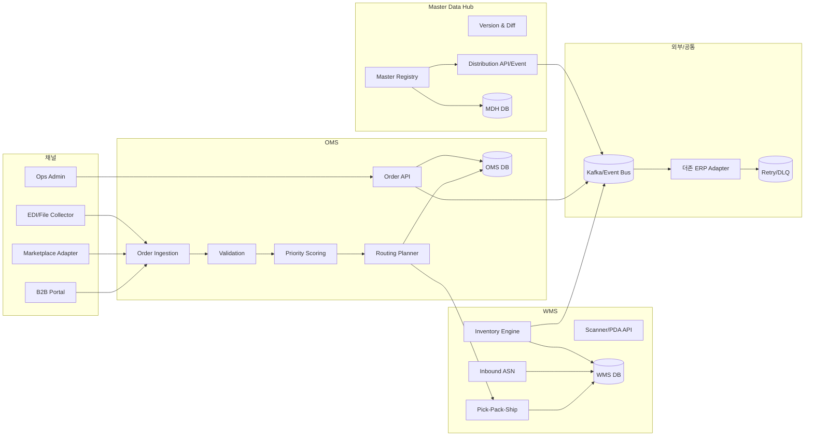
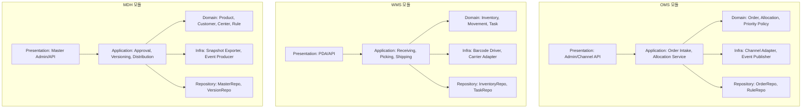

# WJA-20 시스템별 상세 구성도 및 명세서

## 1. 설계 개요
- 목적: OMS/WMS/ERP 연계 및 Master Data Hub 상세 설계를 구현 가능한 수준으로 정의
- 범위: OMS, WMS, Master Data Hub, 더존 ERP 인터페이스, 운영/보안/백업 구조
- 기준: WJA-10 상위 아키텍처, WJA-18 상세 요구사항

## 2. 전제 및 가정
- 트래픽: 주문 15만 건/일, 피크 2,000 TPS(조회 포함)
- 배포 환경: 클라우드 VPC 기반, 운영/검증/개발 계정 분리
- DB: OMS/WMS는 PostgreSQL, MDH는 PostgreSQL + 검색 인덱스(OpenSearch) 사용
- 메시징: Kafka 기반 비동기 이벤트 버스
- ERP: 더존 ERP는 내부망 전용 API + SFTP 배치 파일 수신 지원
- RTO/RPO: RTO 30분, RPO 5분

## 3. 요구사항 반영 포인트
- 기능: 멀티채널 주문 수집, 라우팅, 입출고, 재고정합, ERP 마감 연계, 마스터 표준화
- 비기능: 99.9% 가용성, 수평 확장, 감사로그 1년 보관, DR 리허설 월 1회
- 운영: CI/CD, 중앙 로그, 메트릭/트레이싱, 장애 알림 및 DLQ 기반 복구
- 보안: WAF, mTLS(내부 API), RBAC, 저장/전송 암호화

## 4. 시스템 컨텍스트 다이어그램


## 5. 인프라 구성도


## 6. 시스템 구성도


## 7. 모듈 구조도


## 8. 연계 인터페이스도
```mermaid
flowchart LR
    OMS[OMS]
    WMS[WMS]
    MDH[MDH]
    ERP[더존 ERP]
    CR[택배사]
    BUS[(Kafka)]
    DLQ[(DLQ)]

    MDH -->|1. REST Pull /masters/v1| OMS
    MDH -->|2. REST Pull /masters/v1| WMS
    MDH -->|3. Async master.changed(JSON)| BUS

    OMS -->|4. REST allocate-order| WMS
    WMS -->|5. Async shipment.completed(JSON)| BUS
    BUS -->|6. Consumer| OMS

    OMS -->|7. SFTP CSV: sales/order close| ERP
    WMS -->|8. REST XML/JSON: inventory, inbound| ERP

    WMS -->|9. REST label/request| CR
    OMS -->|10. Retry 3회 + Exponential Backoff| DLQ
    WMS -->|11. Retry 5회 + Circuit Breaker| DLQ
```

## 9. 구성요소별 상세 명세

### 9.1 OMS
- 책임:
  - 채널 주문 표준화/검증/중복제거
  - 우선순위 산정 및 출고센터 라우팅
  - 주문 상태머신 관리 및 고객 채널 피드백
- 내부 인터페이스:
  - `POST /oms/orders/ingest`
  - `POST /oms/orders/{id}/allocate`
  - `GET /oms/orders/{id}`
- 핵심 데이터:
  - `Order`, `OrderItem`, `AllocationPlan`, `OrderEvent`
- 성능 포인트:
  - 멱등키(`channel+externalOrderNo`) 인덱스
  - 라우팅 계산 결과 1분 캐시

### 9.2 WMS
- 책임:
  - 입고(ASN, 검수, 적치), 출고(피킹/패킹/상차), 재고원장 관리
  - 바코드 기반 실시간 작업 통제 및 이력 추적
- 내부 인터페이스:
  - `POST /wms/inbounds/asn`
  - `POST /wms/outbounds/tasks/{taskId}/confirm`
  - `GET /wms/inventory/{skuCode}`
- 핵심 데이터:
  - `Inventory`, `Location`, `Movement`, `Shipment`, `BarcodeTask`
- 성능 포인트:
  - `inventory:{center}:{sku}` 캐시 TTL 3초
  - 재고 변경 이벤트 수신 시 강제 무효화

### 9.3 ERP 연계(더존)
- 송신 데이터:
  - OMS -> ERP: 주문확정/매출마감/취소
  - WMS -> ERP: 입고확정/재고조정/출고확정
- 수신 데이터:
  - ERP -> MDH: 거래처 코드, 회계 기준정보
- 실패 처리:
  - 전송 실패 시 Outbox 적재 -> 재전송 워커
  - 3회 초과 실패는 DLQ + 운영자 알림

### 9.4 Master Data Hub
- 책임:
  - 상품/고객/센터/라우팅 규칙 단일 기준 관리(SSOT)
  - 승인 워크플로우(작성-검토-승인) 및 버전관리
  - OMS/WMS 대상 배포/스냅샷/정합성 검증
- 동기화 정책:
  - 변경건 이벤트 실시간 배포
  - 매일 00:30 전체 스냅샷 배포
  - 수신 시스템 버전 불일치 시 안전모드(읽기전용) 전환

## 10. 운영 및 보안 설계
- 인증/인가:
  - 사용자: OIDC + MFA
  - 시스템 간: OAuth2 Client Credential + mTLS
  - 권한: RBAC(운영자/물류관리자/마스터관리자/감사자)
- 접근통제:
  - 관리망은 Bastion 경유, DB 직접 접근 금지
  - IP Allowlist + WAF 룰셋 + API Rate Limit
- 로그/감사:
  - 주문/재고/마스터 변경은 불변 감사로그 저장(1년)
  - PII 필드(수취인명, 연락처, 주소) 마스킹 후 조회
- 모니터링:
  - SLI: 주문수집 성공률, 재고정합률, ERP 연계성공률, P95 응답시간
  - Alert: 5분 연속 임계치 초과 시 온콜 호출
- 백업/복구:
  - WAL 기반 5분 단위 PITR
  - 일 백업 + 주간 보관 12주
  - DR 리전 복제 및 월 1회 복구 리허설

## 11. 리스크 및 대안
- 리스크: ERP 배치창구 장애로 마감 지연
  - 대안: API 우선 + SFTP 보조 이중 채널, Outbox 버퍼 48시간
- 리스크: 마스터 데이터 품질 저하로 주문 실패율 증가
  - 대안: 승인 전 자동 검증(중복/참조무결성/코드규칙), 배포 전 스테이징 검증
- 리스크: 피크타임 재고 조회 병목
  - 대안: 캐시 샤딩 + 핫SKU 프리워밍 + 읽기복제본 분산

## 12. 추가 확인 필요사항
- 더존 ERP 실제 지원 포맷(XML/JSON/CSV) 최종 확정
- 센터별 PDA 단말 동시 접속 수(무선망 용량 산정)
- 개인정보 보관기간/파기정책 내부 규정 확정
