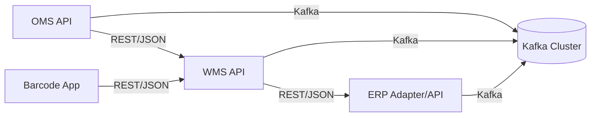

# WJA-21 API 연동 가이드 (개발자용)

## 1. 목적/범위
- 목적: OMS-WMS, WMS-ERP, Barcode App-WMS 연동 구현을 위한 개발 기준 제공
- 범위: HTTP 인터페이스, 인증/인가, 멱등성, 버전 전략, 테스트 시나리오
- 상세 스키마: `openapi.yaml` 참조

## 2. 연동 아키텍처 개요

## 3. 공통 규약
- 프로토콜: HTTPS (TLS 1.2+)
- 콘텐츠 타입: `application/json; charset=utf-8`
- 인증: OAuth2 Client Credentials + JWT Bearer
- 권한 스코프:
  - OMS->WMS: `oms.write`, `oms.read`
  - WMS->ERP: `wms.erp.write`, `wms.erp.read`
  - Barcode App->WMS: `barcode.scan.write`, `barcode.inventory.read`
- 추적 헤더:
  - `X-Trace-Id` (필수)
  - `X-Request-Id` (권장)
  - `X-Idempotency-Key` (생성/취소 API 필수)

## 4. 인터페이스별 구현 포인트

### 4.1 OMS-WMS
- 주문 생성: `POST /v1/oms/orders`
  - 멱등키: `channel + externalOrderNo` 또는 `requestId`
  - 중복 요청 시 `409 OMS_40901`
- 주문 수정: `PATCH /v1/oms/orders/{orderId}`
  - 낙관적 락: `version` 필드 필수
  - 웨이브 릴리스 이후 수정 제한
- 주문 취소: `POST /v1/oms/orders/{orderId}/cancel`
  - 배송/출고 진행 상태면 부분취소 가능성만 반환 (`PARTIAL_CANCEL_REJECTED`)

### 4.2 WMS-ERP
- 입고 확정: `POST /v1/wms/erp/receipts/confirm`
  - ERP 문서번호(`erpDocNo`)를 ACK로 수신
- 마감 데이터: `POST /v1/wms/erp/closing-data`
  - 대용량 라인 데이터는 비동기 처리(`202 QUEUED`)
- 송장 조회: `GET /v1/wms/erp/invoices/{shipmentNo}`
  - 조회 실패 시 재시도보다 운영자 점검 우선

### 4.3 Barcode App-WMS
- 입고/출고 스캔: `/v1/wms/barcode/scans/inbound`, `/outbound`
  - 오프라인 캐시 데이터를 재전송할 수 있으므로 `requestId` 기반 멱등성 적용
- 재고 조회: `GET /v1/wms/inventory?skuCode=&locationCode=`
  - 300ms 내 응답 목표(95p)
- 동기화: `POST /v1/wms/barcode/sync`
  - `lastSyncAt` 이후 델타만 반환

## 5. 데이터 동기화 전략
- Barcode App 오프라인 모드 지원
- 동기화 정책:
  - 앱 -> 서버: 스캔 이벤트 우선 업로드
  - 서버 -> 앱: 마스터/작업지시 델타 다운로드
- 충돌 해결:
  - 서버 수신 시각 기준 Last-Write-Wins
  - 재고수량은 WMS 원장 우선

## 6. 테스트 시나리오 최소 세트
1. 주문 생성 동일 payload 2회 전송 시 1회만 생성
2. 주문 수정 version mismatch 시 409 반환
3. ERP 타임아웃 발생 후 재시도 3회 내 성공
4. Barcode 오프라인 스캔 500건 일괄 동기화 성공
5. Kafka 컨슈머 장애 시 DLQ 적재/복구 검증

## 7. 배포/버전 전략
- URI 버전: `/v1`
- 하위 호환 원칙:
  - 응답 필드 추가 가능
  - 요청 필수 필드 추가는 금지(신규 버전 필요)
- EOL 정책:
  - 메이저 버전 폐기 90일 사전 공지
